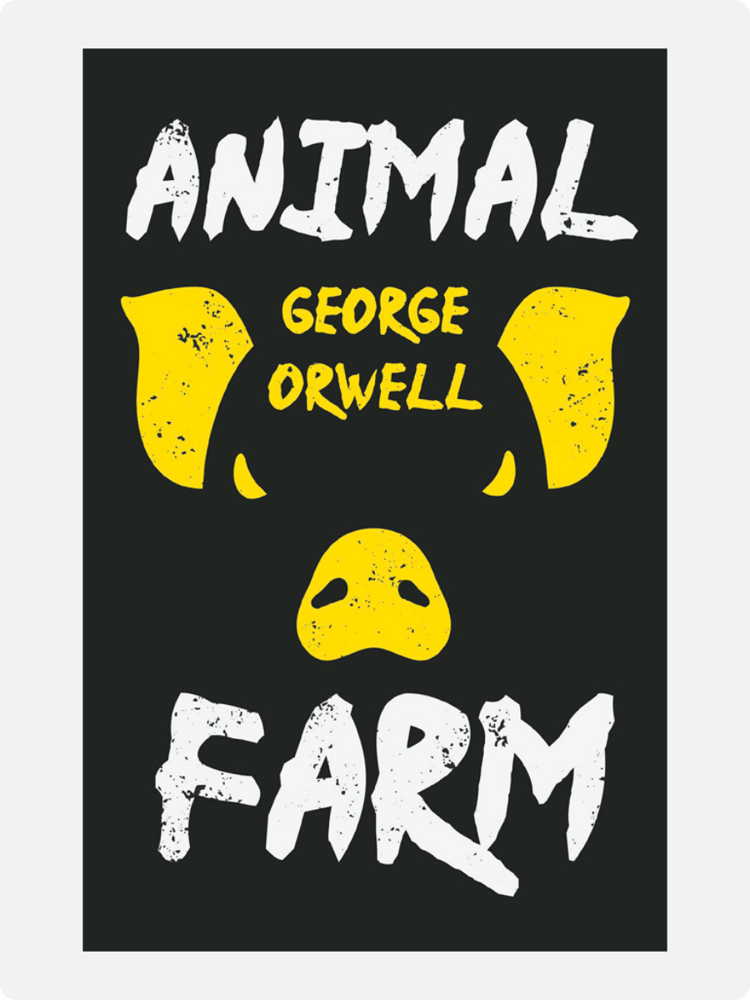

# Animal Farm

George Orwell · 1945

In George Orwell’s *Animal Farm* (1945), farm animals overthrow an owner who takes the produce of their labour. They want enough food, an end to beatings, and a share in what their work creates. Their rebellion begins with a practical hope: life should improve when those doing the work control the farm.

The pigs soon reserve the milk and apples for themselves. Their spokesman, Squealer, says their intellectual work requires better food. He presents this privilege as necessary for everyone’s welfare, then warns that the old farmer could return. The animals’ fear of losing their freedom helps the pigs secure advantages over them.

Boxer, the cart-horse, responds to each difficulty with the promise, “I will work harder!” His strength and loyalty help keep the farm running. But he answers failures of leadership by demanding more of himself. His willingness to serve the others makes him especially useful to rulers who take an increasing share of their labour.

Napoleon, the pigs’ leader, ends public debate and uses dogs to enforce obedience. The pigs change the rules to permit conduct once forbidden to everyone. The farm’s principle of equality eventually becomes: “All animals are equal, but some animals are more equal than others.” The words still promise equality, while authorising unequal treatment.

Orwell wrote the fable in response to Stalin’s Soviet Union. He regarded its ruling hierarchy as a betrayal of the revolution’s promise of liberation. He supported socialism and objected to defending Soviet repression in its name. The animals’ wish for a fairer society has good reasons behind it. Their leaders exploit that hope, along with their fear of returning to the old life.

---

[Selected image and complete provenance](entry.json)
