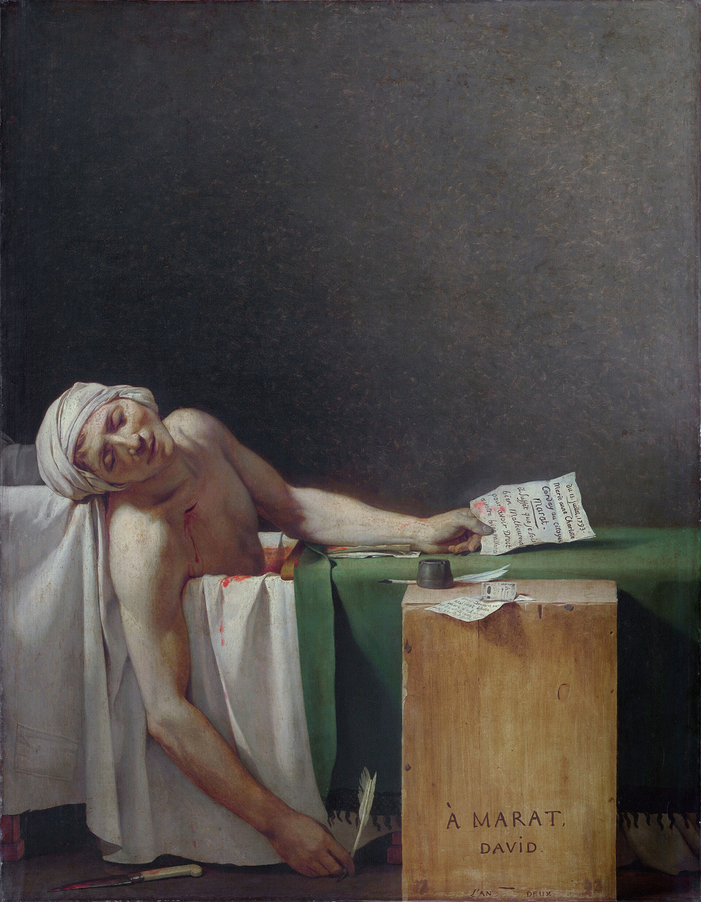

# The Death of Marat

Jacques-Louis David · 1793

Jean-Paul Marat was a journalist and politician during the French Revolution. He demanded the execution of people he considered enemies of the Revolution. In July 1793, Charlotte Corday, a political opponent, stabbed him in his bath. He often worked there because bathing relieved a severe skin condition.

Jacques-Louis David painted *The Death of Marat* later that year. He was Marat’s political ally and a deputy in the National Convention, the assembly governing France. The Convention commissioned him to commemorate the murdered man. The result presents Marat as someone who died serving the people, leaving his role in revolutionary violence outside the picture.

David makes this argument through the body itself. Marat’s lowered head and hanging arm recall images of the dead Christ, particularly Caravaggio’s *The Entombment of Christ*. His skin appears smooth, and a plain wooden box serves as a desk. These choices give him the appearance of a selfless man living simply. Christian images of sacrifice help turn a contemporary political assassination into martyrdom.

The painting hung in the Convention beside David’s portrait of another murdered deputy, Le Peletier. As the assembly conducted its work, the two deaths became examples of sacrifice for the Revolution.

---

[Selected image and complete provenance](entry.json)
