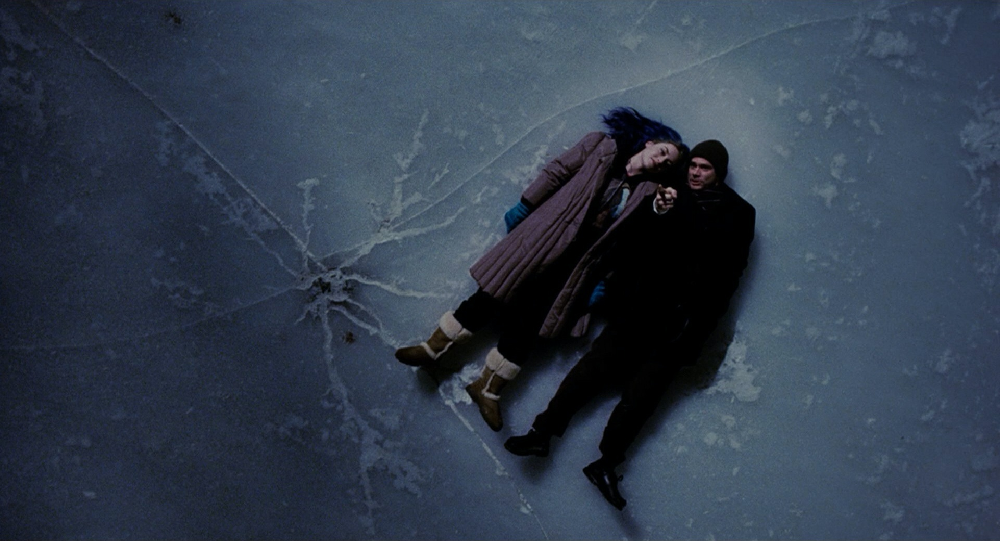

# Eternal Sunshine of the Spotless Mind

Michel Gondry · 2004

In Michel Gondry’s *Eternal Sunshine of the Spotless Mind* (2004), a clinic can erase memories of a particular person. After their breakup, Clementine has her memories of Joel removed. Hurt by Clementine’s decision, he goes through the same procedure.

During the treatment, we follow Joel inside the memories being erased. He relives the arguments near the end of their relationship, then earlier times when they were happy together. As those moments begin to disappear too, he changes his mind. He wants to stop the treatment, although the people carrying it out cannot hear his protests.

In one memory, Clementine tells him how ugly she felt as a child, and he comforts her. Faced with losing this moment of closeness, Joel calls out to the doctor:

> Please let me keep this memory.

Forgetting Clementine would remove much more than the pain of their breakup. Joel would also lose the conversations and shared experiences through which he came to know her. Their affection does not undo the arguments or make them certain to work as a couple. Joel can regret how their relationship ended and still want to remember the time they shared. The procedure gives him no way to keep that experience while removing only the hurt.

---

[Selected image and complete provenance](entry.json)
