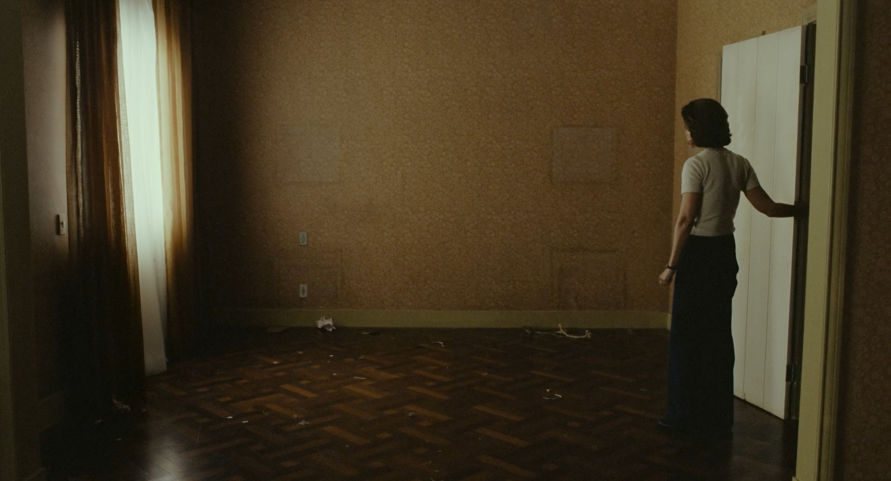

# I’m Still Here

Walter Salles · 2024

Brazil’s 1964 military coup removed an elected government and stripped congressman Rubens Paiva of his mandate. In January 1971, agents took him from his Rio de Janeiro home. He was tortured and killed in custody. The authorities concealed the crime and circulated a false account of his escape. Walter Salles’s *I’m Still Here* (2024) follows the family left behind, drawing on a memoir by Rubens’s son Marcelo.

The film centres on Rubens’s wife, Eunice, who is also imprisoned, along with their teenage daughter Eliana. After her release, she must raise five children while seeking answers from the authorities responsible. Confronting the men watching her home, she asks: “What are you looking at? What do you want? Where’s my husband?” The family cannot bury Rubens, and the government refuses to acknowledge his death.

Before the arrest, Salles shows a busy home full of music, visitors and conversation. This gives us time to know the family before fear changes how they live. Afterwards, Eunice keeps daily life going for the children while deciding how much to tell them. Her composure requires work: she has to care for them while pursuing information that officials continue to withhold.

Eunice’s later life extended this work beyond her own family. She entered law school in 1973, defended Indigenous rights and campaigned for official recognition of the dictatorship’s disappeared. Rubens’s death certificate was issued in 1996, twenty-five years after his arrest. Obtaining it meant forcing the state to acknowledge a death that its own agents had caused and concealed.

---

[Selected image and complete provenance](entry.json)
