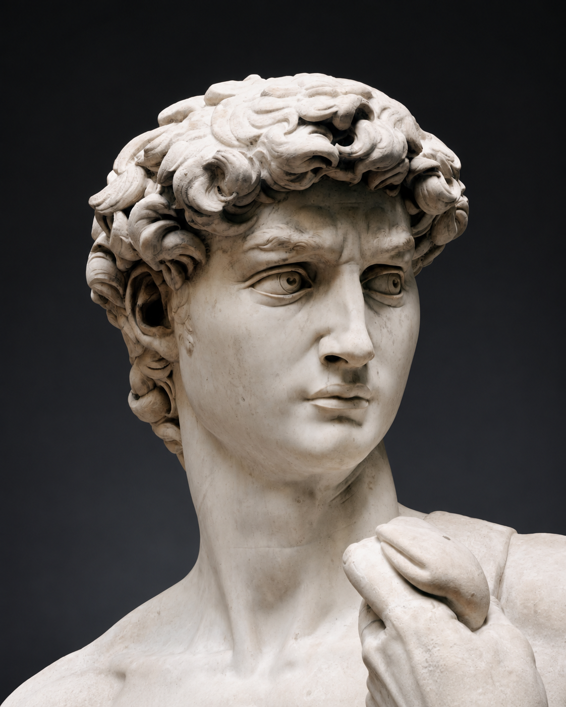

# David

Michelangelo Buonarroti · 1501–1504

In the biblical story, David is a young shepherd who offers to fight Goliath, the armed champion frightening Israel’s soldiers. He rejects the king’s armor and confronts him with a sling and a stone, trusting in God. His victory makes him a model of strength that does not depend on size or military equipment.

Michelangelo shows David before the fight. The sling lies over his shoulder, his brow is drawn, and his head turns toward an opponent we cannot see. There is no defeated giant at his feet. The still body and concentrated gaze direct attention to his readiness for the encounter. His muscular, nude figure recalls ancient heroic sculpture, while the small weapon keeps the biblical story recognizable.

The statue’s enormous scale had a practical origin. Commissioned in 1501, it was intended for a high buttress on Florence’s cathedral, where people would see it from far below. In 1504, a committee chose a different location: beside the entrance to the city’s government palace.

Florence already used David as a symbol of its capacity to resist stronger opponents. At the palace, the religious hero became a public emblem of the republic’s independence. The change of location gave his watchful stance a political role, placing a defender outside the building where the city was governed.

---

[Selected image and complete provenance](entry.json)
