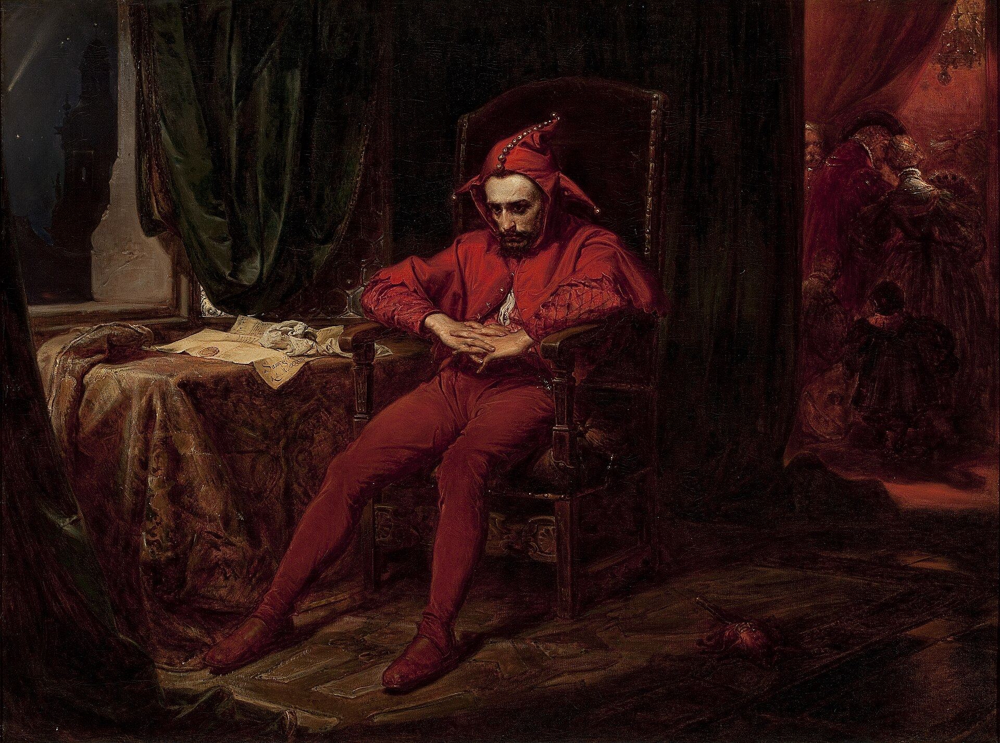

# Stańczyk

Jan Matejko · 1862

In Jan Matejko’s *Stańczyk* (1862), a Polish court jester sits alone while a royal ball continues nearby. The painting’s full title connects his distress with the loss of Smolensk, a fortress captured by Muscovite forces in 1514.

The jester’s position gives the scene its political criticism. His job is to amuse the court, yet he seems to take the country’s troubles more seriously than its courtiers. Through the doorway, the guests continue their festivities. He remains apart, with his hands clasped and his attention elsewhere. The person expected to entertain becomes the person capable of serious judgment.

Matejko painted this scene centuries after the defeat, when Poland was divided among neighbouring powers. National history gave him a way to examine how the country had lost its independence and what public responsibility required. He also gave Stańczyk his own facial features. This identification suggests a role for the painter similar to the jester’s: using art to question the conduct of those in power.

---

[Selected image and complete provenance](entry.json)
