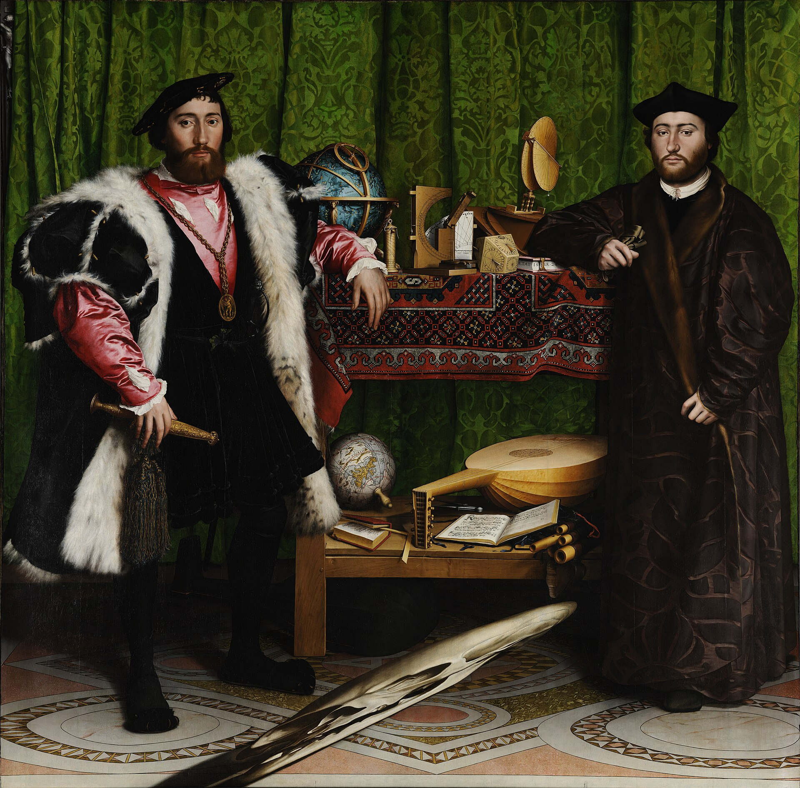

# The Ambassadors

Hans Holbein the Younger · 1533

Hans Holbein the Younger’s *The Ambassadors* (1533) portrays two French diplomats surrounded by expensive clothes, books and scientific instruments. These possessions present them as men of standing and learning. Across the foreground lies a stretched shape that becomes recognisable as a skull when viewed at a sharp angle from the right.

This distortion is called anamorphosis. It makes the reminder of death difficult to read from the position where the rest of the portrait looks clear. Moving to the side reveals the skull in proportion. The effect gives unusual force to a familiar practice in European portraiture: including a skull as a *memento mori*, a reminder that the sitter will die.

The portrait preserves the men’s accomplishments while placing them alongside that limit. Their wealth and knowledge remain impressive, but cannot protect them from death. A partly hidden crucifix at the upper left gives this thought a Christian setting. The skull recalls human mortality; the image of Christ adds the promise of salvation and life after death. Together, these details connect the diplomats’ worldly position with beliefs about what lies beyond it.

---

[Selected image and complete provenance](entry.json)
