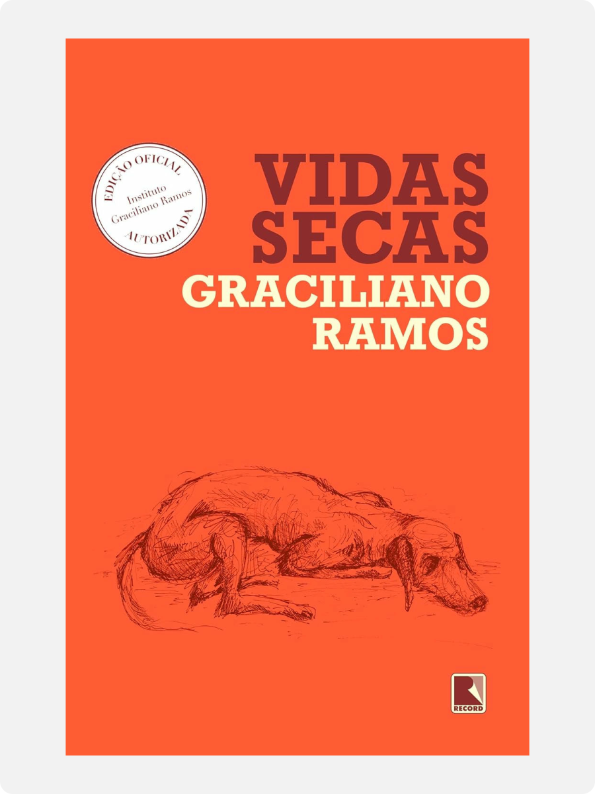

# Vidas Secas

Graciliano Ramos · 1938

Graciliano Ramos’s *Vidas Secas* (1938) follows a fictional family of *retirantes*: people driven from their homes by drought and poverty. Fabiano, Sinha Vitória, their two boys and their dog, Baleia, cross Brazil’s northeastern interior looking for food and work. A farm where they can stay offers relief, but little security.

Fabiano works as a cattle herder on land he does not own. His employer pays him less than he is owed. When Fabiano complains, the man tells him to look for work elsewhere. Losing the job would also mean losing the family’s home. This dependence helps explain why their poverty continues even when the drought ends.

Fabiano struggles to put his thoughts into words before people who can punish or dismiss him. Their authority makes him doubt his own worth. “You’re an animal, Fabiano,” he tells himself, while also taking pride in his endurance. The narration lets us follow thoughts that he cannot easily express aloud. Sinha Vitória’s calculations, the boys’ curiosity and Baleia’s affection give each a life beyond the struggle for food.

Ramos had been imprisoned without formal charges under Getúlio Vargas in 1936. He later connected living alongside poor prisoners with his ability to write about their lives. The novel gives sustained attention to people whose limited speech and low social standing make it easy for others to disregard them.

The parents imagine a city where their boys could attend school. Their imagined city remains unnamed. The search connects their story to Brazil’s wider history of internal migration. From 1935, São Paulo subsidised migrants’ journeys to supply its coffee and cotton farms with workers. That history helps explain the uncertainty surrounding the family’s hope: leaving the drought could bring new work without ending their dependence on employers.

---

[Selected image and complete provenance](entry.json)
